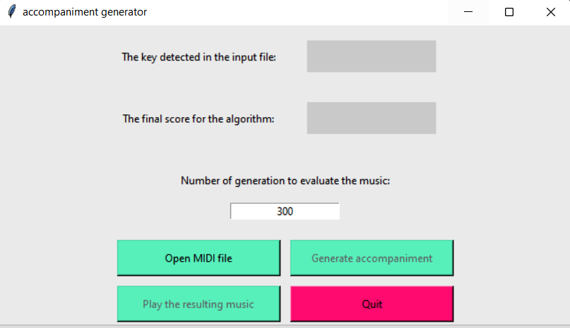

[](https://opensource.org/licenses/MIT)
# Accompaniment Generation
This is an assignment for the Introduction to Artificial Intelligence course in Innopolis University
## Task
You are given several monophonic midi files, which are representing melodies. By using an
evolutionary algorithm (EA), you have to generate an accompaniment for each of those melodies. You
are allowed to use any type of EA, however, you are obliged to use both crossover and mutation for
evolving accompaniment. Accompaniment should be represented by a sequence of chords. Each chord
should contain exactly three notes. For simplicity you have to consider only the next types of chords:

- major and minor triads
- first and second inversions of major and minor triads
- diminished chords (DIM)
- suspended second chords (SUS2)
- suspended fourth chords (SUS4)

The initial melody cannot be modified as long as tempo, time signature, etc.
The output MIDI file has to contain two musical batches:
* the initial unmodified melody
* the generated accompaniment

It means that both of those batches will be played in duet. Moreover, the accompaniment can also be played by any instrument. Nevertheless, any other
additional modifications to the original melody will be considered as a violation of the rules.
Assume that each input melody will be written in a non-changing tempo (which may vary for
different inputs) and time signature (4/4 aka C or common time).

For accompaniment, you should
consider that each bar contains 4 quarter duration chords . There are two bars in this figure
divided by a vertical line in the middle. Both bars contain 4 notes of the same duration of quarter, for
the accompaniment, there will be 3 simultaneously played notes instead of 1. Time
signature defines the number of beats contained in each bar (the upper numeral) and which note value
is equivalent to the beat (the lower numeral). In case of necessity, some chords may be replaced by
rests.

# Requirments
* **Python**  *version ^3.7.0*
* **Tkinter**  *version ^2.1.2*
* **music21**  *version ^8.1.0*
* **Pygame:**  *version ^2.1.2*

# Running the program
* First, to run the program you need to install python requirements

```bash
pip install pygame, tk, music21
```
* To run the program type
```bash
python main.py
```

# Program overview
## After running the program the following interface will appear

<p align="center">

</p>

* I implemented the program to be user friendly using ***tKinter*** package.
* Before choosing the file, buttons Generate accompaniment and Play the resulting music will be disabled. To choose the input music, the user has to click on Open MIDI file button.

* After clicking open MIDI file button, the user will choose his input file from his PC. Once the user selects his file, the program will show the key detected in the input file.
* Then, the user is free to choose any Number of generations to create the music. The default is 300, but increasing this number will give better results with slower run time. In addition, a progress bar below will be shown to indicate how much the algorithm did so far.
* After finishing all the generations, an output file, named AhmadAlhussin-DetectedKey.mid will be generated, you can either open it manually or click play the resulting music button.
* Moreover, the user can choose to generate multiple times by clicking Generate Accompaniment button multiple times, and the program will output the best result ou
